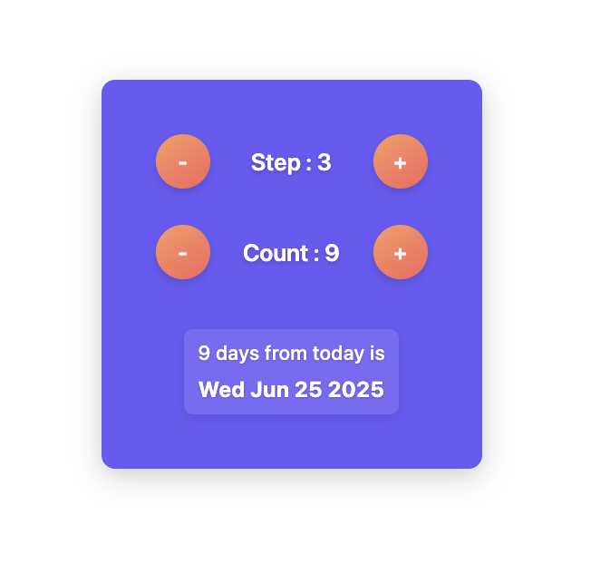

# Date Jumper🕰️

A minimal React app to calculate dates based on a customizable day counter.
Change the step with a slider, adjust the count manually or with buttons, and instantly see the date offset from June 16, 2025. Clean UI with reset functionality.


## 🛠️ Technologies Used

- **React 19.1.0** (with Hooks - useState)
- **CSS3** (with animations, gradients, and hover effects)

## 🏃‍♂️ Getting Started

### Prerequisites

- Node.js (v14 or higher)
- npm or yarn

### Installation

1. **Clone the repository:**

```bash
git clone [your-repo-url]
cd counter
```

2. **Install dependencies:**

```bash
npm install
```

3. **Start the development server:**

```bash
npm start
```


## Screenshot




